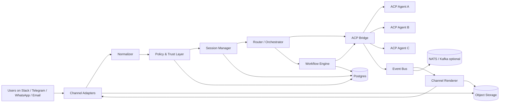
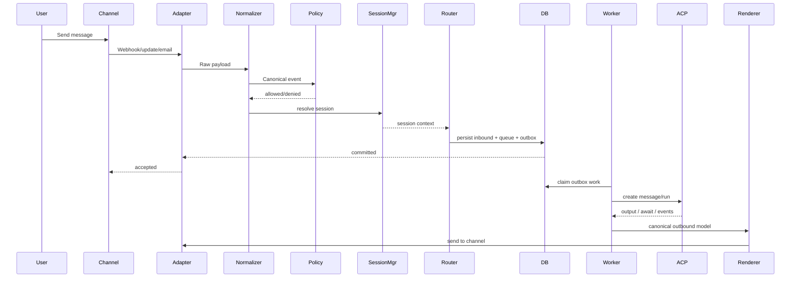
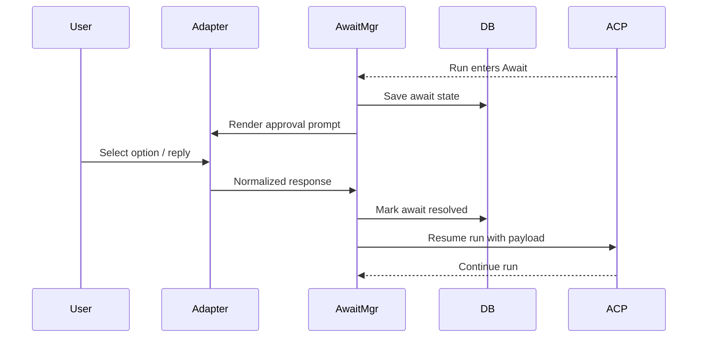
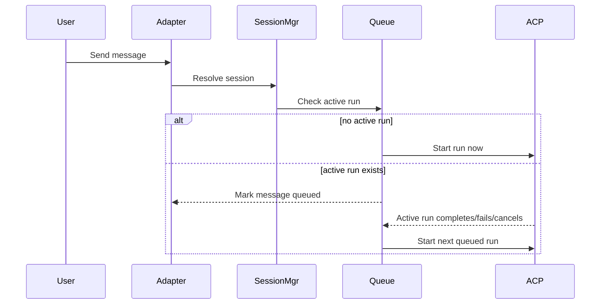
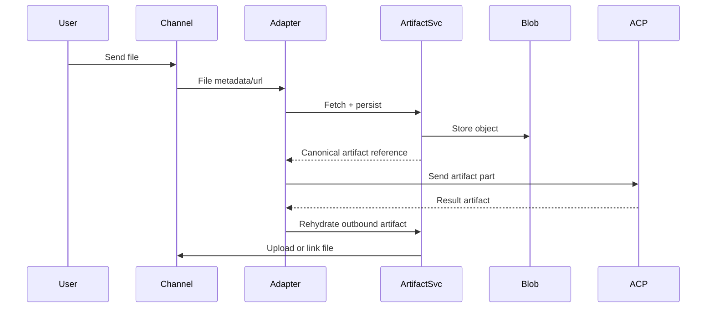
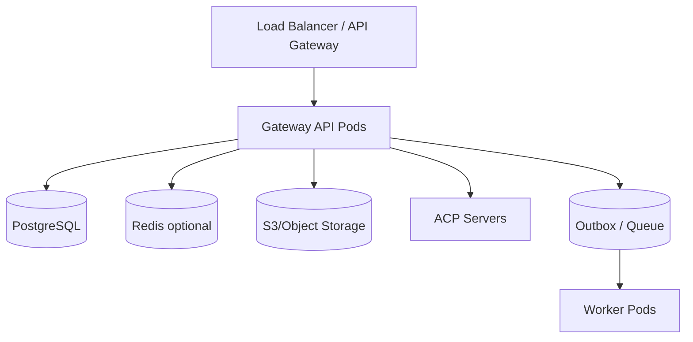

# ACP Channel Gateway Architecture & Implementation Plan (Golang)

## 1. Executive Summary

This document proposes a **reusable channel gateway** that converts human-facing messaging channels into **ACP-compatible agent interactions**.

Instead of integrating each agent directly with Slack, Telegram, WhatsApp, or email, we introduce a **Gateway Layer** that:

1. receives inbound channel events,
2. normalizes them into a canonical conversation model,
3. maps them to ACP sessions, messages, runs, artifacts, and await/resume interactions,
4. routes requests to one or more ACP-compatible agents,
5. translates agent outputs back into channel-native UX.

The result is a system where:

- **channel integrations are reusable across many agents**, and
- **agents are reusable across many channels**.

This architecture is especially suitable for:

- customer support agents,
- internal copilot/chatops agents,
- coding agents with plan/approval mode,
- workflow agents requiring human approval,
- multimodal assistants that exchange files, screenshots, images, and documents.

---

## 2. Why ACP is a good backbone

ACP provides the core protocol primitives the gateway needs:

- **REST-based agent interaction**
- **stateful sessions**
- **structured, multi-part MIME messages**
- **artifacts/files as named message parts**
- **run lifecycle** for sync, async, and streaming work
- **await/resume** so agents can pause for human input and continue later
- **agent discovery / manifests** so the gateway can route to compatible agents dynamically

This makes ACP a good internal contract between the gateway and agents, while channel-specific UX remains in the adapter layer.

---

## 3. Goals and Non-Goals

### 3.1 Goals

- Build one **shared messaging gateway** for Slack, Telegram, WhatsApp, and email.
- Make the gateway **agent-agnostic** as long as agents speak ACP.
- Support **plan/confirm/choose** flows consistently across channels.
- Support **stateful conversations** and long-running async jobs.
- Preserve **artifacts** such as images, PDFs, code patches, and reports.
- Allow **multi-agent routing**, policy checks, and approvals.
- Implement the core system in **Go** for strong concurrency, operational simplicity, and easy deployment.
- Support a **single-tenant** operating model with multiple workspaces/channels under one administrative boundary.

### 3.2 Non-Goals

- Recreating each channel’s full native UX in ACP.
- Assuming all channels have equal fidelity.
- Embedding business logic inside channel adapters.
- Coupling the gateway to a single agent framework.

---

## 4. ACP primitives the gateway will target

The gateway should translate channels into the following ACP concepts:

| ACP primitive | Meaning inside the gateway |
|---|---|
| Agent | The downstream ACP-capable service that performs work |
| Session | Durable conversational context across many runs |
| Run | One invocation/execution cycle of an agent |
| Message | Canonical inbound or outbound content, made of MIME-typed parts |
| Artifact | Named file or output, e.g. PDF, image, patch, JSON |
| Await | Agent pauses and requests external input |
| Resume | User or system supplies missing input so the run continues |
| Streaming | Partial progress or incremental output |
| Manifest / Discovery | Metadata used for routing and compatibility checks |

---

## 5. Channel capability translation matrix

### 5.1 Fidelity legend

- **Native**: maps cleanly to ACP
- **Adapter**: possible, but the gateway must add conventions
- **Lossy**: possible only approximately

### 5.2 Matrix

| Capability | Slack | Telegram | WhatsApp | Email | ACP mapping |
|---|---|---|---|---|---|
| Plain text | Native | Native | Native | Native | `Message.parts[text/plain]` |
| Files/images | Native | Native | Native | Native | `Artifact` or MIME part |
| Reply/thread context | Native | Adapter | Adapter | Adapter | `session_id`, run context |
| Buttons/choice selection | Native | Native | Adapter | Lossy | `Await` + structured `Resume` |
| Free-form answer | Native | Native | Native | Native | `Resume` text payload |
| Async long-running job | Native | Native | Native | Native | async `Run` |
| Streaming partial output | Adapter | Adapter | Lossy | Lossy | stream events |
| Message edits | Native-ish | Adapter | Limited | Poor | gateway UX extension |
| Reactions | Adapter | Adapter | Weak | No | optional metadata |
| Voice/audio | Adapter | Adapter | Adapter | Attachment-based | MIME artifact |
| Rich cards/forms | Strong | Good | Limited | Weak | adapter-specific UX |
| Group mention wake-up | Native-ish | Adapter | Adapter | N/A | routing convention |

### 5.3 Design implications

1. **Slack** is the highest-fidelity ACP UX surface.
2. **Telegram** is strong for interactive approval flows.
3. **WhatsApp** should prefer short menus and compact choices.
4. **Email** is best treated as an asynchronous ACP transport, not a rich interactive runtime.

---

## 6. High-level system architecture



### 6.1 Core idea

The system is divided into **two stable boundaries**:

1. **Channel boundary**: Slack, Telegram, WhatsApp, Email adapters.
2. **Agent boundary**: ACP bridge and agent runtime integration.

Everything in between is a reusable gateway core.

---

## 7. Component architecture

## 7.1 Channel Adapters

Each channel adapter is responsible for:

- receiving inbound webhooks, polling results, or IMAP events,
- validating authenticity,
- converting channel-specific messages into a canonical inbound event,
- sending outbound messages or files,
- rendering await prompts into the best UX available for the channel,
- reporting delivery status when possible.

Adapters should contain **no business logic** and minimal policy logic.

### Adapter responsibilities by channel

#### Slack Adapter
- inbound Events API / slash / interactive callbacks
- thread mapping via channel + thread_ts
- buttons, block actions, file posting, message updates
- channel, DM, mention, and thread awareness

#### Telegram Adapter
- webhook or long polling updates
- inline keyboard handling
- callback query handling
- chat ID / message ID mapping
- media upload/download

#### WhatsApp Adapter
- Meta webhook receiver
- mapping of text, image, document, voice, and reply buttons/lists
- limited interactivity rendering
- compact response mode

#### Email Adapter
- SMTP receive or mail ingestion service
- IMAP polling or webhook from provider
- MIME parsing and attachment extraction
- threading heuristics using Message-ID / In-Reply-To / References
- slower asynchronous UX path

---

## 7.2 Canonical Normalizer

The normalizer converts every inbound channel message into one internal schema.

### Canonical inbound event

```json
{
  "event_id": "evt_123",
  "channel": "slack",
  "tenant_id": "t_001",
  "provenance": {
    "source_type": "webhook",
    "provider_event_id": "Ev04ABC123",
    "received_at": "2026-04-05T09:00:00Z",
    "signature_verified": true,
    "delivery_attempt": 1
  },
  "sender": {
    "channel_user_id": "U123",
    "display_name": "Alice",
    "is_authenticated": true,
    "identity_assurance": "provider_verified",
    "roles": ["developer"]
  },
  "conversation": {
    "channel_conversation_id": "C456",
    "channel_thread_id": "1712345678.9012"
  },
  "message": {
    "message_id": "m_789",
    "message_type": "text",
    "parts": [
      {
        "content_type": "text/plain",
        "content": "Please deploy to staging"
      }
    ],
    "artifacts": []
  },
  "metadata": {
    "mentions_bot": true,
    "interaction_type": "message",
    "responder_binding": {
      "mode": "same-user-only",
      "allowed_channel_user_ids": ["U123"]
    },
    "artifact_trust": "trusted-channel-ingress"
  }
}
```

This schema should be owned by the gateway, not by any specific channel.

It should also carry enough **trust and identity metadata** for policy, approval, and replay-safe await/resume handling. Do not rely on raw provider payloads alone for these decisions.

---

## 7.3 Session Manager

The session manager maps channel conversations into ACP sessions.

### Core rule

A **channel conversation** is not automatically equal to an ACP session.
The gateway decides the mapping.

### Recommended mapping

| Channel | Session key recommendation |
|---|---|
| Slack | tenant + workspace + channel_id + thread_ts_or_message_ts + user scope policy |
| Telegram | tenant + bot_id + chat_id + optional topic/thread + user scope |
| WhatsApp | tenant + business_account + phone_number + conversation window or explicit topic |
| Email | tenant + mailbox + normalized thread key derived from Message-ID / References |

### Session modes

Support at least three modes:

1. **Per-thread session**: one ACP session per thread.
2. **Per-user continuous session**: a user has one persistent ACP session.
3. **Per-workflow session**: explicit session created by the gateway for a specific task.

### Session storage

Persist:

- session ID
- channel mapping keys
- owning tenant/workspace
- selected agent or workflow
- last active timestamp
- state flags (open, paused, archived)
- trust/policy attributes

---

## 7.3A Multi-Session UX and Virtual Sessions

Many coding agents support multiple concurrent sessions, but several messaging channels present a single persistent conversation surface per user or phone number.

The gateway should distinguish between:

- **channel-derived sessions**: sessions inferred from native channel structures such as Slack threads or Telegram topics
- **virtual sessions**: gateway-managed sessions created inside a single DM or email thread when the channel does not provide native session separation

### Channel-native vs virtual session model

| Channel | Native session primitive | Recommendation |
|---|---|---|
| Slack | thread | Use thread as the default session boundary; support explicit new/switch/close commands for DMs or non-thread usage |
| Telegram | topic/thread in groups; weak in DMs | Use topics when available; use virtual sessions for DMs |
| WhatsApp | none in DM beyond one chat | Use virtual sessions for any multi-session experience |
| Email | thread heuristics only | Use subject/thread as default, but allow explicit workflow/session references |

### Core design rule

Do **not** force every DM on WhatsApp or Telegram into one long-lived ACP session if the agent product supports multiple work contexts.

Instead, the gateway should support explicit session operations:

- `create`: start a new named or unnamed session
- `switch`: change the active virtual session for that channel/user surface
- `close`: archive the current session and optionally detach it from the active surface
- `list`: show recent sessions that can be resumed

### Recommended UX by channel

- **Slack**: prefer thread-per-session; also support commands such as `/new`, `/switch`, `/close` for DMs
- **Telegram**: use forum topics in groups when available; in DMs support commands/buttons for virtual sessions
- **WhatsApp**: use compact text commands such as `/new deploy`, `/sessions`, `/switch deploy`, `/close`
- **Email**: support explicit session IDs or workflow IDs in the subject/body for branching off a fresh workflow

### Session command contract

Standard gateway session commands:

- `/new`
- `/switch`
- `/sessions`
- `/close`

These commands should be **gateway-reserved**, but configurable per channel and per tenant.

Recommended policy:

- commands may be enabled or disabled per channel
- commands may be enabled or disabled per tenant/workspace
- channels with weak command UX may expose the same operations via buttons, menus, or numbered replies

This keeps the conceptual contract stable while still allowing channel-specific product decisions.

Command semantics:

- `/new <alias>` creates a new session and optionally assigns the provided alias
- `/switch <alias-or-id>` switches the active session pointer to the requested session
- `/sessions` lists recent and available sessions for that channel surface
- `/close` archives the current session and leaves no active session until the user explicitly switches or creates another one

### Active session pointer

For channels without a strong native session primitive, persist an **active session pointer** per tenant + channel account + user/chat surface.

This allows:

- one DM surface to host many archived sessions
- deterministic routing for follow-up messages
- safe switching without mutating historical session IDs

### Session ownership and namespace isolation

Each session must be resolved inside an explicit ownership scope.

For channel-local sessions, the minimum scope is:

- `tenant_id`
- `channel_type`
- `channel_surface_key`

Implications:

- a WhatsApp user can only list or switch sessions inside their own WhatsApp surface namespace
- a Telegram user can only list or switch sessions inside their own Telegram surface namespace
- aliases are not globally unique and must never be resolved globally
- raw session IDs must still pass an ownership check before access or switching is allowed

Recommended invariant:

- a session may only be attached to the same ownership scope that created it, unless an explicit share or transfer policy exists

This prevents user A from switching into user B's session even if they guess an alias or obtain a raw session ID.

### Omni-channel continuity via identity linking

If the product should allow a user to continue the same work from WhatsApp, Telegram, Slack, or email, then session ownership must support a **canonical user identity** above channel-specific identities.

Use three layers:

1. **channel identity**: e.g. WhatsApp phone number, Telegram user ID, Slack user ID
2. **canonical user identity**: internal user record owned by the gateway/product
3. **linked identities**: mappings from one canonical user to one or more channel identities

Recommended rule:

- unlinked users only access channel-local sessions
- linked users may access sessions owned by their canonical user identity across channels

### Omni-channel session access model

For omni-channel deployments:

- session ownership should be bound to `owner_user_id`
- active session pointers should remain channel-local
- switching the active session on WhatsApp should not automatically switch the active session on Telegram

This gives the user cross-channel continuity without surprising cross-channel pointer changes.

### Approval policy remains channel-sensitive

Even if a session is visible across channels, approval privileges do not have to be.

Example:

- a user may review the same session from WhatsApp and Telegram
- but deploy approval may still be restricted to Slack or the admin web UI

So the gateway should separate:

- **session visibility policy**
- **action and approval policy**

### Session lifecycle policy

Support these state transitions:

- `open`
- `paused`
- `archived`
- `expired`

Recommended behaviors:

- idle timeout may move a session to `expired`
- `close` should archive but preserve history
- `switch` should only change the active pointer, not rewrite previous mappings
- await prompts should remain bound to their original session even if the user later switches the active session

### Per-session run concurrency policy

The gateway should allow **parallel runs across different sessions**, but should treat each individual session as a **single-active-run lane**.

Recommended default:

- only one active run per session
- new normal inbound messages for that session are queued
- queue ordering is FIFO by accepted inbound event time
- when the active run completes, fails, or is canceled, the next queued item starts

This is the safest policy for stateful coding agents and for any ACP session where replies, artifacts, and awaits must remain unambiguous.

### Await interaction with queueing

If the active run enters `awaiting`:

- the expected await response may bypass the queue and resume the active run
- unrelated normal messages should remain queued
- control commands such as `cancel`, `close`, `switch`, or `new` may bypass the queue if policy allows

This prevents ambiguous input while still allowing human approval flows to continue.

### Queue behaviors to define

At minimum, support:

- queue item TTL / expiration policy
- user-visible acknowledgment that a message was queued
- deduplication so webhook retries do not create duplicate queued items
- operator policy for whether high-priority admin commands can interrupt the active run

### Default queue policy

Recommended default policy:

- `switch` waits behind the active run and does not bypass the queue
- normal users cannot bypass the queue
- admins may issue a force-cancel operation
- maximum queue depth is configurable, with a default of `3`

If the queue is full, the gateway should reject the new message with a channel-appropriate explanation instead of accepting unbounded backlog.

### Why this differs from simpler chat bots

Many chat bots collapse one DM into one persistent memory stream. That is convenient for lightweight assistants but becomes limiting for coding agents, workflow agents, and approval-heavy systems where users need several independent work contexts.

The gateway should therefore treat **virtual session management as a first-class platform feature**, especially for WhatsApp, Telegram DMs, and email.

---

## 7.4 Router / Orchestrator

The router decides where an inbound event goes.

### Routing inputs

- channel
- tenant
- workspace / bot identity
- channel connection or external account identity
- mentioned alias / command prefix
- message intent
- previous session state
- policy constraints
- available agent manifests

### Routing outputs

- target agent profile
- target ACP agent
- workflow to invoke
- direct reply vs background run
- whether approval is required

### Routing modes

1. **Static route**: channel or alias maps to one agent.
2. **Intent-based route**: classifier/router picks an agent.
3. **Workflow route**: route to a workflow engine that may call several agents.
4. **Escalation route**: send to human review queue.

### Agent profiles vs ACP connections

Separate these concepts:

- **ACP connection**: how the gateway reaches an ACP backend
- **Agent profile**: the gateway-level behavior and policy assigned to a channel connection or route

An agent profile may include:

- `acp_connection_id`
- target ACP agent name or manifest selector
- model override
- enabled skills
- allowed tools or MCP integrations
- approval and risk policy
- channel-specific render or behavior preferences

Recommended rule:

- reuse the same ACP connection when multiple profiles talk to the same backend/runtime
- create separate ACP connections only when endpoint, auth boundary, runtime environment, or operational isolation is different

This avoids unnecessary secret duplication while still allowing one binary/backend to expose multiple distinct agent behaviors.

---

## 7.5 ACP Bridge

The ACP bridge is the most important abstraction. It converts canonical gateway actions into ACP calls.

### Responsibilities

- discover available agents
- cache manifests and capabilities
- create/find ACP sessions
- submit messages and artifacts
- start runs in sync/async/stream modes
- subscribe to run state transitions
- interpret Await states
- resume paused runs with structured user input
- map ACP artifacts back to gateway artifacts

### Bridge interface in Go

```go
type ACPBridge interface {
    DiscoverAgents(ctx context.Context, tenantID string) ([]AgentManifest, error)
    EnsureSession(ctx context.Context, req EnsureSessionRequest) (ACPPath, error)
    StartRun(ctx context.Context, req StartRunRequest) (RunHandle, error)
    StreamRun(ctx context.Context, req StartRunRequest) (<-chan RunEvent, error)
    ResumeRun(ctx context.Context, req ResumeRunRequest) (RunHandle, error)
    CancelRun(ctx context.Context, req CancelRunRequest) error
}
```

### Why a bridge instead of direct client calls

- isolates ACP SDK/client changes,
- centralizes retries, auth, and observability,
- makes testing easier,
- supports multiple ACP servers or registries.

---

## 7.6 Await/Resume Manager

This component turns ACP human-in-the-loop requests into channel-native prompts.

### Example flow

1. User asks coding agent to update a repo.
2. Agent analyzes and returns an ACP `Await`:
   - choose strategy A/B/C,
   - confirm touching 24 files,
   - supply environment: dev/staging/prod.
3. Gateway stores the pending await state.
4. Renderer sends channel-native prompt:
   - Slack buttons,
   - Telegram inline keyboard,
   - WhatsApp reply buttons/list,
   - Email reply instructions.
5. User responds.
6. Adapter normalizes that response.
7. Await/Resume Manager creates structured resume payload.
8. ACP Bridge resumes the run.

### Pending await record

```json
{
  "await_id": "awt_001",
  "run_id": "run_123",
  "session_id": "sess_456",
  "channel": "telegram",
  "prompt_type": "choice",
  "schema": {
    "type": "enum",
    "values": ["safe", "balanced", "aggressive"]
  },
  "expires_at": "2026-04-06T00:00:00Z"
}
```

### Important design rule

Do **not** hardcode await rendering inside the ACP bridge. Keep it in a separate manager because rendering is channel-specific.

---

## 7.7 Channel Renderer

The renderer converts canonical outbound content into channel-native output.

### Input types

- plain text
- rich text / markdown-ish text
- artifacts
- structured choices
- progress updates
- final result bundles

### Output policies

Because channels differ, implement two layers:

1. **Canonical render model**
2. **Channel-specific render policy**

### Canonical content classes

At minimum, the renderer should recognize these outbound classes:

- `text`
- `await-choice`
- `await-confirm`
- `progress`
- `artifact`
- `final-result`

### Degradation rule

The renderer should preserve **intent**, not exact formatting.

Examples:

- buttons may degrade into numbered choices
- rich cards may degrade into structured plain text
- long rich output may degrade into summary + artifact link

The downgrade decision should be made centrally by the renderer, not improvised independently by each channel adapter.

### Canonical render model example

```json
{
  "type": "await-choice",
  "title": "Choose deployment target",
  "body": "The agent is ready to deploy. Select one target.",
  "choices": [
    {"id": "dev", "label": "Development"},
    {"id": "staging", "label": "Staging"},
    {"id": "prod", "label": "Production"}
  ]
}
```

### Render examples

- Slack: buttons / block kit sections
- Telegram: inline keyboard
- WhatsApp: reply buttons or list
- Email: numbered options + “reply with 1, 2, or 3”

### Channel degradation policy

Use a deterministic degradation ladder:

1. rich interactive rendering
2. structured plain text rendering
3. artifact or signed-link fallback
4. deferred milestone/final summary for weak channels

### Hard safety rule

Degradation must never increase ambiguity.

In particular:

- approval prompts must remain deterministic
- truncation must be explicit
- the user must always know how to continue or respond

### Recommended per-channel policy

#### Slack

- preferred mode: rich interactive
- choices: buttons first, numbered list if needed
- progress: message edits or thread updates
- long output: chunk by section, then fall back to artifact
- artifacts: native upload first, link fallback second

#### Telegram

- preferred mode: inline keyboard or concise formatted text
- choices: inline keyboard first, numbered list fallback
- progress: paced message edits or follow-up messages
- long output: chunk conservatively, then artifact fallback
- artifacts: native upload when supported, otherwise signed link

#### WhatsApp

- preferred mode: compact text-first UX
- choices: reply buttons/list only when small enough, otherwise numbered list
- progress: sparse status updates only, avoid chatty streaming
- long output: short summary plus artifact/link
- approvals: prefer deterministic reply format such as `Reply: 1`

#### Email

- preferred mode: asynchronous summary UX
- choices: numbered list with explicit reply instructions
- progress: no live streaming, only milestone or final summaries
- long output: summary in body plus attachment or link
- approvals: require explicit reply token such as `Approve awt_123 yes` or numbered response

### Threshold-based fallback

The renderer should apply channel thresholds such as:

- maximum interactive choices before converting to numbered text
- maximum outbound text length before chunking
- maximum chunk count before falling back to artifact/link
- maximum inline artifact size before using object storage link

These thresholds should be configurable per channel.

---

## 7.8 Artifact Service

This service handles all inbound and outbound files.

### Responsibilities

- download channel attachments
- virus/malware scan if needed
- deduplicate by hash
- store binary in object storage
- create signed URLs where appropriate
- map files into ACP artifacts
- map ACP artifacts back into channel-uploadable form

### Artifact metadata to persist

- artifact ID
- source channel
- mime type
- filename
- size
- sha256
- object storage location
- originating message/run/session IDs

---

## 7.8A Outbound Delivery Lifecycle

Outbound delivery should be modeled as a lifecycle, not a one-shot `send`.

### Why it matters

The gateway must support:

- initial send
- message update/edit
- prompt replacement
- repeated delivery attempts
- delivery correlation across one logical message and many provider events

This becomes critical for streaming, await prompt updates, Slack message edits, Telegram callback-driven updates, and retry-safe worker processing.

### Recommended model

Represent one logical outbound message separately from concrete delivery attempts.

- **Outbound message**: gateway-owned logical response or prompt
- **Outbound delivery**: one send/update attempt to a specific channel target
- **Channel message reference**: provider IDs needed for later edits or correlation

### Minimum fields to persist

- logical outbound message ID
- session ID
- run ID
- await ID if applicable
- delivery kind (`send`, `update`, `replace`, `delete`)
- provider message reference(s)
- provider correlation/request ID if available
- status (`queued`, `sent`, `delivered`, `failed`, `superseded`)
- attempt count
- last error
- rendered payload snapshot

### Interface implication

Channel adapters will usually need lifecycle-aware operations such as create vs update, even if the first MVP only implements the subset required by Slack.

---

## 7.9 Policy & Trust Layer

This component decides what the gateway is allowed to do.

### Why it matters

A channel gateway is a shared control surface. A message that looks innocent may trigger powerful agent actions.

### Minimum policy checks

- tenant/workspace allowlist
- sender identity validation
- bot mention / wake-up rules
- group-chat restrictions
- allowed agents per channel
- allowed tools/actions per channel
- approval requirements for risky actions
- artifact upload/download constraints
- PII / sensitive-content controls

### Example policy decisions

- In Slack public channels, the coding agent can **plan** but cannot **apply** without explicit approval.
- In WhatsApp, only support and FAQ agents are allowed.
- In email, destructive actions are disabled entirely.

---

## 7.10 Event Bus and Workflow Engine

For simple systems, direct synchronous routing is enough.
For production, introduce an event bus.

### Event types

- inbound.message.received
- session.mapped
- acp.run.started
- acp.run.awaiting
- acp.run.progress
- acp.run.completed
- acp.run.failed
- channel.delivery.sent
- channel.delivery.failed

### Benefits

- decouples adapters from routing
- enables retries and dead-letter handling
- supports async fan-out
- simplifies audit logging and analytics

### Workflow engine use cases

- multi-agent pipelines
- human approval chains
- timeouts and reminders
- escalation to humans
- compensating actions on failure

---

## 8. Recommended Go package structure

```text
/cmd
  /gateway
  /worker
  /migrator
/internal
  /app
  /config
  /httpx
  /auth
  /logging
  /metrics
  /tracing
  /domain
    /channel
    /session
    /message
    /artifact
    /await
    /run
    /policy
  /adapters
    /slack
    /telegram
    /whatsapp
    /email
    /acp
    /storage
    /queue
    /db
  /services
    /normalizer
    /router
    /renderer
    /sessionmgr
    /awaitmgr
    /artifactsvc
    /policysvc
    /workflow
  /ports
    /inbound
    /outbound
  /usecases
    /handleinbound
    /handleawaitresponse
    /sendoutbound
/pkg
  /contracts
  /client
  /events
```

### Architectural style

Use **hexagonal / ports-and-adapters**.

Why:

- channels are external systems,
- ACP servers are external systems,
- storage is replaceable,
- business rules stay in services/use-cases,
- testing becomes much easier.

---

## 9. Data model

## 9.1 Core tables

### `tenants`
- id
- name
- config_json
- created_at

### `channel_connections`
- id
- tenant_id
- channel_type
- external_account_id
- agent_profile_id
- encrypted_credentials_ref
- status
- created_at

### `acp_connections`
- id
- tenant_id
- base_url
- auth_config_ref
- status
- created_at
- updated_at

### `agent_profiles`
- id
- tenant_id
- acp_connection_id
- acp_agent_name
- model_override
- enabled_skills_json
- allowed_tools_json
- policy_profile_json
- channel_behavior_json
- status
- created_at
- updated_at

### `linked_identities`
- id
- tenant_id
- channel_type
- channel_user_id
- internal_user_id
- authn_level
- pairing_state
- paired_at
- last_verified_at
- status

### `users`
- id
- tenant_id
- status
- created_at
- updated_at

### `sessions`
- id
- tenant_id
- owner_user_id
- agent_profile_id
- channel_type
- channel_scope_key
- acp_connection_id
- acp_server_url
- acp_agent_name
- acp_session_id
- mode
- state
- last_active_at
- created_at
- updated_at

### `session_aliases`
- id
- tenant_id
- session_id
- owner_user_id
- channel_type
- channel_surface_key
- alias
- is_active
- created_by_actor_id
- created_at
- updated_at

### `channel_surface_state`
- id
- tenant_id
- channel_type
- channel_surface_key
- owner_user_id
- active_session_id
- updated_at

### `messages`
- id
- tenant_id
- session_id
- direction (inbound/outbound)
- channel_type
- channel_message_id
- role
- text_preview
- raw_payload_json
- created_at

### `artifacts`
- id
- message_id
- direction
- name
- mime_type
- size_bytes
- sha256
- storage_uri
- created_at

### `runs`
- id
- session_id
- acp_run_id
- agent_name
- mode
- status
- started_at
- completed_at
- last_event_at

Recommended statuses:

- `queued`
- `starting`
- `running`
- `awaiting`
- `completed`
- `failed`
- `canceled`
- `expired`

### `session_queue_items`
- id
- tenant_id
- session_id
- inbound_message_id
- queue_position
- status
- enqueued_at
- started_at
- completed_at
- expires_at

### `awaits`
- id
- run_id
- session_id
- channel_type
- status
- schema_json
- prompt_render_model_json
- expires_at
- resolved_at

### `inbound_receipts`
- id
- tenant_id
- channel_type
- provider_event_id
- provider_delivery_id
- interaction_type
- actor_channel_user_id
- first_seen_at
- last_seen_at
- duplicate_count
- status

### `await_responses`
- id
- await_id
- actor_channel_user_id
- actor_identity_assurance
- response_payload_json
- idempotency_key
- accepted_at
- rejected_reason

### `outbound_deliveries`
- id
- tenant_id
- session_id
- run_id
- await_id
- logical_message_id
- channel_type
- delivery_kind
- provider_message_id
- provider_request_id
- status
- attempt_count
- last_error
- payload_json
- created_at
- updated_at

### `outbox_events`
- id
- tenant_id
- event_type
- aggregate_type
- aggregate_id
- idempotency_key
- payload_json
- status
- available_at
- claimed_at
- processed_at
- attempt_count
- last_error

### Retention defaults

Retention should be configurable per tenant, data class, and channel if needed.

Recommended default retention:

- messages: 30 days
- raw payloads: 30 days
- artifacts: 30 days unless explicitly preserved by policy
- audit events: 30 days unless longer retention is required for compliance

The gateway should support scheduled purge jobs and tenant-specific overrides.

### `audit_events`
- id
- tenant_id
- category
- actor_type
- actor_id
- object_type
- object_id
- payload_json
- created_at

## 9.2 Constraints and locking rules

The implementation should define database constraints and worker-claim rules explicitly.

### Recommended unique constraints

- `channel_connections`: unique on `(tenant_id, channel_type, external_account_id)`
- `linked_identities`: unique on `(tenant_id, channel_type, channel_user_id)`
- `session_aliases`: unique on `(tenant_id, owner_user_id, channel_type, channel_surface_key, alias)`
- `channel_surface_state`: unique on `(tenant_id, channel_type, channel_surface_key, owner_user_id)`
- `inbound_receipts`: unique on `(tenant_id, channel_type, provider_event_id)`
- `await_responses`: unique on `(await_id, idempotency_key)`
- `outbox_events`: unique on `idempotency_key` where appropriate

### Queue and outbox claim strategy

Workers should claim queue or outbox rows with a transaction-safe pattern such as:

- `SELECT ... FOR UPDATE SKIP LOCKED`
- update claimed timestamp and worker owner
- commit before external side effects

This prevents duplicate workers from starting the same run or sending the same outbound delivery.

### Ownership and active-pointer updates

Operations such as `switch`, `close`, queue promotion, and await resolution should update ownership-sensitive rows inside short transactions.

Use row-level locking or optimistic version checks when updating:

- `channel_surface_state`
- `session_queue_items`
- `awaits`
- `outbox_events`

### Indexing priorities

At minimum, add indexes for:

- session lookup by `(tenant_id, channel_type, channel_scope_key)`
- session ownership lookup by `(tenant_id, owner_user_id)`
- queue scan by `(session_id, status, queue_position)`
- outbox scan by `(status, available_at)`
- delivery retry scan by `(status, updated_at)`

---

## 9.3 Configuration and admin model

The gateway now depends on runtime-manageable configuration. This should be modeled explicitly rather than left as implicit JSON blobs.

### Configuration layers

Use a hybrid model:

1. **bootstrap config** from file/env for service startup and secret references
2. **runtime config** in the database for channel connections, agent profiles, policies, and admin-managed overrides

### Configurable objects

At minimum, support:

- channel connections
- ACP connections
- agent profiles
- reserved session command policy per channel
- pairing policy and approval state
- retention overrides
- channel degradation thresholds

### Admin API / service responsibilities

The admin surface should operate through explicit service-layer APIs for:

- approve or deny pairing requests
- list and edit channel connections
- list and edit agent profiles
- inspect sessions and active runs
- force cancel a run
- retry failed outbound deliveries
- inspect and edit policy overrides
- inspect retention settings

### Recommended configuration shape

Avoid storing all behavior in one large JSON blob.

Prefer explicit records for core routing and security entities, with scoped JSON only for fields that truly vary by adapter or agent profile.

---

## 10. Inbound and outbound flow details

## 10.1 Inbound flow



### Step-by-step

1. Validate webhook signature or channel authenticity.
2. Normalize payload.
3. Apply trust/policy checks.
4. Resolve or create session.
5. Route to target agent/workflow.
6. Persist inbound message, receipt, queue state, and outbox event in one DB transaction.
7. Commit and return accepted to the channel/provider.
8. Worker consumes outbox and starts ACP run.
9. Stream, await, or complete.
10. Render outbound response.
11. Persist audit trail.

## 10.1A Transactional Boundaries and Recovery Model

Use a **DB-first + outbox** model.

### Required rule

The gateway must never depend on “ACP accepted the run” as the first durable fact.

Instead:

1. Persist the inbound event and intended work in the database.
2. Write an outbox job/event in the same transaction.
3. Commit.
4. Let a worker perform ACP and outbound side effects.

This avoids orphaned ACP runs and makes retries and crash recovery tractable.

### Inbound transaction contents

At minimum, the inbound transaction should persist:

- inbound receipt / dedup record
- canonical inbound message
- resolved session reference
- queue item or pending run-start intent
- route decision snapshot
- outbox event

### Worker responsibilities

The worker should:

- claim one outbox event idempotently
- start the ACP run for the queued message
- persist ACP run ID and transition the queue item to running
- persist await/completion/failure state transitions
- enqueue outbound delivery work as additional outbox events

### Recovery and reconciliation

Introduce a reconciler for stuck or ambiguous states:

- outbox event persisted but not yet processed
- queue item stuck in `starting`
- ACP run created but completion event delayed
- outbound delivery persisted but provider acknowledgment missing

The reconciler should re-drive work idempotently and query ACP/provider state when needed.

### Important invariant

One accepted queue item may produce **at most one ACP run**.

Use a stable idempotency key derived from the queue item or inbound message so retries cannot create duplicate runs.

---

## 10.2 Await/Resume flow



### Design notes

- Every await should have a stable `await_id`.
- Responses must be idempotent.
- Expired awaits must reject late replies gracefully.
- Resume payloads should be typed, not ad hoc strings when possible.
- Await responses should bypass the normal session queue only when they match the active pending await.

## 10.2A Session Queue Flow



### Queueing rules

- each session has at most one active run
- messages for other sessions are unaffected
- queued items are processed FIFO
- valid await responses target the active run directly instead of joining the queue
- duplicate inbound deliveries must not create duplicate queue items

---

## 10.3 Artifact flow



---

## 11. ACP integration details

## 11.1 Session strategy

ACP itself is stateless at the transport layer, but supports sessions for stateful agents. The gateway should own session continuity and always pass consistent ACP session identifiers where state is required.

### Recommendation

- Store ACP session ID in the gateway database.
- Never derive session IDs on the fly after creation.
- Support session affinity when downstream agents require it.

## 11.1A Minimum ACP Agent Compatibility Contract

For an agent to be treated as fully compatible with this gateway platform, it should support:

- **await/resume**: required
- **streaming**: required
- **artifact input/output**: required

Implication:

- agents that cannot pause for human input are not suitable for the approval and workflow model described here
- agents that cannot stream are not suitable for the progress UX expected on higher-fidelity channels
- agents that cannot consume or emit artifacts are not suitable for the multimodal and coding-oriented use cases targeted by this gateway

This should be enforced during agent onboarding, discovery, or manifest validation.

## 11.2 Agent discovery

Use ACP agent manifests to discover:

- supported input content types,
- output content types,
- agent name/description,
- metadata for routing,
- availability/health status.

### Routing example

If Telegram adapter receives image + caption, the router can prefer agents whose manifests support `image/*` input.

If two WhatsApp numbers point to the same ACP backend but use different agent profiles, the router should select the profile bound to the inbound `channel_connection_id`, then use that profile's ACP connection and behavior settings.

## 11.3 Streaming

Streaming is valuable, but not every channel can represent it well.

### Recommended strategy

- Slack: stream via message update or incremental thread replies.
- Telegram: batch partial output into paced edits or follow-up messages.
- WhatsApp: avoid overly chatty streaming; use periodic status updates.
- Email: convert streaming into final or milestone summaries only.

## 11.4 Run status mapping

| ACP run state | Gateway state | Channel UX |
|---|---|---|
| created | accepted | optional acknowledgment |
| in-progress | running | typing/progress/status update |
| awaiting | waiting-user | approval prompt / question |
| completed | done | final answer/artifacts |
| failed | failed | error message + retry hint |

---

## 12. Go implementation strategy

## 12.1 Technology recommendations

### Language/runtime
- Go 1.24+ or your current supported LTS-like internal baseline
- standard `context.Context` everywhere
- standard `net/http` for core services

### HTTP/router
Choose one:
- standard `net/http` + small helper layer, or
- `chi` if you want lightweight routing

For a gateway platform, I would favor **stdlib-first** plus small focused dependencies.

### Persistence
- PostgreSQL for core relational state
- Redis optional for ephemeral locks, rate limits, and short-lived await caches
- S3-compatible object storage for artifacts

### Messaging / async
- Start with PostgreSQL outbox pattern
- Add NATS or Kafka only when scale or team topology justifies it

### Observability
- OpenTelemetry tracing
- Prometheus metrics
- structured JSON logging

### Config/secrets
- environment variables + secret manager
- per-tenant encrypted credential references, never raw secrets in business tables

---

## 12.2 Go libraries and integration choices

These are pragmatic choices, not mandatory ones:

- **Slack**: `github.com/slack-go/slack`
- **Telegram**: either `github.com/go-telegram/bot` or `github.com/go-telegram-bot-api/telegram-bot-api/v5`
- **Email**: `github.com/emersion/go-smtp`, `github.com/emersion/go-imap`, `github.com/emersion/go-message`
- **WhatsApp**: direct HTTP client against Meta Cloud API / webhooks, usually wrapped in your own adapter package
- **ACP client**: generate from ACP OpenAPI if needed, or build a thin typed client manually if the surface is small
- **OpenAPI codegen**: `oapi-codegen` is a strong fit in Go

### Why manual wrappers still matter

Even if you use SDKs, hide them behind your own interfaces so the rest of the system does not depend on third-party types.

---

## 12.3 Concurrency model

Go is a strong fit because the gateway is I/O-heavy and event-driven.

### Use goroutines for

- webhook handling
- background artifact fetches
- async ACP run polling/stream consumption
- rate-limited outbound sends
- retry workers

### But avoid

- passing domain ownership implicitly through channels everywhere
- unbounded goroutine creation
- business logic scattered across worker loops

### Recommendation

Use **synchronous request handlers** for the critical path, then publish **explicit jobs/events** for slower work.

## 12.4 Baseline operational targets

Define baseline non-functional targets early so queueing, timeout, and retry behavior can be implemented coherently.

Recommended starting targets:

- webhook acknowledgment: under 2 seconds on the normal path
- queued message start latency: under 10 seconds when workers are healthy and queue depth is below limit
- outbox retry backoff: bounded exponential backoff with jitter
- reconciler interval: every 30 to 60 seconds
- maximum inline artifact size: configurable per channel/provider

These are initial engineering targets, not permanent SLAs, but they should be concrete enough to drive implementation.

---

## 13. Suggested interfaces in Go

## 13.1 Channel adapter port

```go
type ChannelAdapter interface {
    Channel() string
    VerifyInbound(ctx context.Context, r *http.Request) error
    ParseInbound(ctx context.Context, r *http.Request) (CanonicalInboundEvent, error)
    SendMessage(ctx context.Context, req SendMessageRequest) (SendMessageResult, error)
    SendArtifact(ctx context.Context, req SendArtifactRequest) (SendArtifactResult, error)
    SendAwaitPrompt(ctx context.Context, req SendAwaitPromptRequest) (SendPromptResult, error)
}
```

## 13.2 Session manager port

```go
type SessionManager interface {
    Resolve(ctx context.Context, req ResolveSessionRequest) (Session, error)
    Touch(ctx context.Context, sessionID string) error
    Archive(ctx context.Context, sessionID string) error
}
```

## 13.3 Router port

```go
type Router interface {
    Route(ctx context.Context, evt CanonicalInboundEvent, session Session) (RouteDecision, error)
}
```

## 13.4 Await manager port

```go
type AwaitManager interface {
    Register(ctx context.Context, req RegisterAwaitRequest) (AwaitRecord, error)
    Resolve(ctx context.Context, req ResolveAwaitRequest) (ResolvedAwait, error)
    Expire(ctx context.Context, now time.Time) error
}
```

## 13.5 Outbox worker port

```go
type OutboxWorker interface {
    Claim(ctx context.Context, now time.Time, limit int) ([]OutboxEvent, error)
    Process(ctx context.Context, evt OutboxEvent) error
    MarkFailed(ctx context.Context, eventID string, err error, nextAttemptAt time.Time) error
}
```

## 13.6 Admin service port

```go
type AdminService interface {
    ApprovePairing(ctx context.Context, req ApprovePairingRequest) error
    DenyPairing(ctx context.Context, req DenyPairingRequest) error
    ForceCancelRun(ctx context.Context, req ForceCancelRunRequest) error
    RetryDelivery(ctx context.Context, req RetryDeliveryRequest) error
    SwitchSession(ctx context.Context, req SwitchSessionRequest) error
}
```

## 13.7 Profile resolver port

```go
type ProfileResolver interface {
    ResolveForChannelConnection(ctx context.Context, tenantID string, channelConnectionID string) (AgentProfile, error)
}
```

## 13.8 Policy/config repository port

```go
type PolicyRepository interface {
    GetChannelPolicy(ctx context.Context, tenantID string, channelConnectionID string) (ChannelPolicy, error)
    GetRetentionPolicy(ctx context.Context, tenantID string) (RetentionPolicy, error)
    GetCommandPolicy(ctx context.Context, tenantID string, channelType string) (CommandPolicy, error)
}
```

---

## 14. Security architecture

## 14.1 Threat model

Main risks:

- spoofed inbound webhook/event
- prompt injection through channel messages/files
- unauthorized user triggering powerful tools
- shared-channel confusion across multiple users
- leaked artifacts or signed URLs
- replay attacks on interactive callbacks
- stale await responses applied to wrong runs

## 14.2 Required controls

### Inbound authenticity
- verify webhook signatures for Slack/Meta/etc.
- verify Telegram bot token path or equivalent ingress control
- verify SMTP/IMAP source trust assumptions if ingesting email directly

### Authorization
- per-tenant policy
- per-channel policy
- per-agent allowlist
- per-action risk class

### Public-channel authentication

For channels such as WhatsApp and Telegram, **provider authenticity is not the same as user authentication**.

The gateway may know that an event genuinely came from Meta or Telegram, while still having no strong proof that the sender is authorized to run a coding, admin, or workflow agent.

Use a sender trust ladder:

- **anonymous**: unknown sender, not yet approved
- **allowlisted-channel-user**: sender explicitly allowed by channel identifier
- **paired-user**: sender completed a gateway-managed pairing or operator approval step
- **linked-user**: channel identity is mapped to an internal user/account
- **verified-user**: linked user with fresh step-up verification for a sensitive action

Recommended policy by risk:

- low-risk actions may be allowed for paired or allowlisted users
- tenant-specific data access should require linked identity
- code changes, deployments, destructive tools, or privileged workflows should require verified identity plus explicit approval

### Pairing and allowlist modes

Public channels should support these ingress modes:

- `disabled`: reject all inbound requests for that surface
- `allowlist`: only preapproved sender IDs may interact
- `pairing`: unknown senders must complete an operator-approved pairing flow before commands are accepted
- `open`: allow all senders, but only for very low-risk use cases

`allowlist` and `pairing` are pragmatic and effective for personal or small-team agents. They should not be treated as sufficient by themselves for high-risk enterprise actions.

Recommended default:

- deny by default for unknown public-channel senders
- require explicit admin approval before pairing is completed

### Identity linking and step-up auth

For higher-trust deployments, support account linking:

1. User contacts the bot in Telegram or WhatsApp.
2. Gateway returns a one-time link or pairing code.
3. User authenticates in a trusted surface such as the web app, Slack workspace, or SSO login page.
4. Gateway binds `channel_user_id` to `internal_user_id`.
5. Sensitive actions require fresh verification or explicit approval before resume/apply.

This allows public channels to serve as the **conversation surface** without making raw channel identity the only authority for privileged actions.

For omni-channel continuity, this linking step is what allows the same human to resume or switch sessions across WhatsApp, Telegram, Slack, or email while keeping authorization checks explicit.

### Interaction safety
- destructive actions require explicit await approval
- store callback nonce / CSRF-like token on interactive prompts
- enforce prompt expiration
- idempotency keys for resume actions

### Data safety
- encrypt secrets at rest
- short-lived signed URLs
- malware scanning for uploaded files
- redact sensitive logs

### Retention and deletion

Retention should be configurable, but the default policy should be **30 days**.

At minimum, the gateway should support:

- scheduled purge of expired messages, payloads, artifacts, and audit records
- tenant-level retention overrides
- deletion workflows that also clean up object storage
- clear separation between operational retention and compliance/legal-hold retention

---

## 15. Observability and operations

## 15.1 Tracing

Create one end-to-end trace spanning:

- inbound channel event
- normalization
- session resolution
- route decision
- ACP request
- await/resume if applicable
- outbound delivery

## 15.2 Metrics

Minimum metrics:

- inbound events by channel
- route decisions by agent
- ACP run latency
- ACP await count / timeout count
- outbound delivery success/failure
- artifact upload/download volumes
- policy denials
- duplicate webhook drops

## 15.3 Logging

Use structured logs with stable fields:

- tenant_id
- channel
- session_id
- run_id
- await_id
- adapter
- event_type
- outcome

Never log raw credentials and avoid logging full message bodies unless explicitly allowed by policy.

---

## 15.4 Admin Surface

The primary operational control surface should be a **web UI**.

It should support at minimum:

- sender pairing approval or denial
- allowlist and linked-identity management
- session inspection
- force cancel for stuck or risky runs
- queue visibility
- retry or replay of failed outbound deliveries
- retention overrides and policy inspection

The web UI should sit on top of the same service-layer and policy APIs used internally by the gateway.

## 16. Deployment architecture

## 16.1 Minimum production topology



### Components

- **Gateway API pods**: webhook ingress, normalization, synchronous routing
- **Worker pods**: async sends, artifact processing, retries, timeout handling
- **Postgres**: durable state
- **Object storage**: files/artifacts
- **Redis optional**: rate-limit, locks, ephemeral state
- **ACP servers**: one or more downstream agent services
- **Web UI**: administrative control surface for approvals, sessions, retries, and policy operations

## 16.2 Scalability

Scale API pods horizontally because the protocol surface is HTTP-centric.
Use DB-backed idempotency and outbox patterns before introducing a heavy queue.

### Operational recommendation

Treat PostgreSQL as the first queueing substrate via the outbox pattern.
Only introduce NATS or Kafka later if throughput, fan-out, or team boundaries justify the added complexity.

## 16.3 HA considerations

- stateless API replicas
- durable session/run/await persistence
- retry-safe outbound operations
- idempotent webhook handling
- ACP bridge retries with circuit breaker/backoff
- reconciler for stuck `starting` runs and unprocessed outbox events

---

## 17. Implementation roadmap

## Phase 0: Foundations

### Deliverables
- domain model finalized
- canonical message schema finalized
- tenant and session model finalized
- initial Postgres schema
- observability baseline
- inbound idempotency model finalized
- responder binding / actor authorization model finalized
- outbound delivery lifecycle model finalized
- public-channel authentication and pairing model finalized
- DB-first transactional model and outbox contract finalized
- single-tenant operating model finalized
- hybrid policy configuration model finalized
- web UI admin surface requirements finalized
- ACP connection model and agent profile model finalized

### Tasks
- define internal contracts
- define event taxonomy
- create migration stack
- implement structured logger + tracing + metrics
- define provider event dedup keys and callback replay strategy
- define who is allowed to answer an await in shared channels
- add receipt, await-response, and outbound-delivery persistence
- define sender trust levels for public channels
- define allowlist, pairing, and linked-identity flows
- define virtual session model and active-session-pointer rules for DM-like channels
- define per-session run queueing and interruption policy
- define inbound transaction contents and outbox event taxonomy
- define reconciler rules for `starting` runs and stuck deliveries
- define per-channel enable/disable policy for reserved session commands
- define default 30-day retention jobs and override hooks
- define agent manifest validation for await/resume, streaming, and artifact support
- define config bootstrap in file/env and runtime overrides in DB
- define admin web UI scope for approvals, sessions, retries, and policy management
- separate ACP backend connection settings from agent-profile behavior settings

---

## Phase 1: ACP bridge and one channel

### Recommendation
Start with **Slack + ACP** because it has the best UX fidelity for await/resume and threaded interactions.

### Deliverables
- ACP Bridge v1
- Slack adapter v1
- session manager v1
- router v1 (static route)
- renderer v1
- artifact service v1
- callback replay protection and inbound dedup v1
- actor-bound await/resume enforcement v1
- per-session queueing v1
- outbox worker and reconciler v1
- minimal admin API and web UI v1

### Tasks
- support text in/out
- support files in/out
- support thread-based sessions
- support await/resume with buttons
- support completed/failed/in-progress mapping
- store and reject duplicate webhook and interactive callback deliveries
- enforce that only eligible actors can approve or resume pending awaits
- support Slack message update for prompt refresh and progress status
- queue new messages when a thread/session already has an active run
- persist inbound state before ACP side effects
- start ACP runs from worker/outbox processing
- reconcile stuck `starting` runs and redrive unprocessed outbox work
- expose pairing approval, session inspection, force cancel, and delivery retry in the admin surface

### Exit criteria
- one ACP agent can serve one Slack workspace reliably
- plan/confirm/apply flow works end to end
- duplicate deliveries do not trigger duplicate runs or duplicate resumes
- await responses from unauthorized users are rejected safely
- new messages in the same session are queued and processed FIFO
- worker retries and recovery do not create duplicate ACP runs
- operators can approve pairings and recover failed work without direct database edits

---

## Phase 2: Telegram and shared abstractions

### Deliverables
- Telegram adapter v1
- generalized prompt renderer
- reusable interactive-choice abstraction
- Telegram sender allowlist/pairing enforcement
- Telegram virtual session commands

### Tasks
- support inline keyboard
- callback query handling
- chat/user/topic session mapping
- photo/document flows
- enforce `allowlist` / `pairing` / `open` DM policy
- support sender-to-internal-user linking hooks if the product requires higher trust
- support `create` / `switch` / `list` / `close` for DM virtual sessions

### Exit criteria
- same ACP agent can be used from Slack and Telegram without agent changes
- unknown Telegram senders cannot trigger privileged actions without configured trust policy
- Telegram DMs can host multiple independent sessions without cross-session leakage

---

## Phase 3: WhatsApp compact interaction mode

### Deliverables
- WhatsApp adapter v1
- compact prompt mode
- stricter outbound formatting rules
- WhatsApp sender allowlist/pairing enforcement
- WhatsApp virtual session commands

### Tasks
- text/media support
- reply-button or list rendering
- phone-number identity model
- voice note ingest path if relevant
- enforce `allowlist` / `pairing` / `open` DM policy
- support step-up or out-of-band approval for sensitive actions
- support `create` / `switch` / `list` / `close` for DM virtual sessions using compact command UX

### Exit criteria
- support approval and artifact delivery flows within WhatsApp constraints
- unknown WhatsApp senders cannot trigger privileged actions without configured trust policy
- WhatsApp DMs can host multiple independent sessions without collapsing all work into one memory stream

---

## Phase 4: Email asynchronous mode

### Deliverables
- Email adapter v1
- MIME artifact ingestion
- thread mapping heuristics
- asynchronous await rendering format

### Tasks
- inbound MIME parsing
- attachment extraction
- Message-ID/In-Reply-To/References handling
- reply parser for numbered choices and free-text responses

### Exit criteria
- email can participate in async approve/review/result workflows

---

## Phase 5: Policy, workflow, and multi-agent routing

### Deliverables
- policy engine v1
- workflow engine v1
- agent manifest cache/discovery v1
- intent-based routing v1
- hybrid policy configuration with DB overrides
- admin web UI v1

### Tasks
- per-tenant policy rules
- approval requirements by risk class
- route based on manifest capabilities
- multi-agent orchestration for specific workflows
- expose policy editing and approval operations through the web UI

---

## Phase 6: Production hardening

### Deliverables
- rate limiting
- dead-letter handling
- replay protection
- chaos/resilience tests
- SLO dashboards

### Tasks
- implement idempotency store
- add circuit breakers and retries
- load testing
- queue backpressure controls
- tenant isolation tests

---

## 18. Testing strategy

## 18.1 Unit tests

- normalizer tests per channel payload type
- session resolution logic
- route decisions
- await/resume schema validation
- renderer degradation behavior per channel
- deterministic approval fallback behavior
- truncation and artifact fallback behavior

## 18.2 Integration tests

- Slack -> ACP -> Slack roundtrip
- Telegram -> ACP -> Telegram roundtrip
- await -> resume -> completion flow
- artifact upload/download roundtrip
- policy deny path

## 18.3 Contract tests

- ACP client/server contracts against manifest/run/await flows
- channel callback contract tests using recorded fixtures

## 18.4 End-to-end tests

- coding agent plan approval
- customer support escalation
- image artifact delivery
- timeout + retry + late resume rejection

---

## 19. Operational recommendations

1. **Start with one channel and one agent type.** Slack + coding/support agent is the best first slice.
2. **Keep session mapping explicit.** Hidden heuristics become painful later.
3. **Treat await/resume as a first-class subsystem.** It is the key bridge between agent autonomy and human control.
4. **Do not overstream on weak channels.** Especially WhatsApp and email.
5. **Keep adapters thin and declarative.** Business rules belong in the gateway core.
6. **Use artifacts heavily.** Do not squeeze every file into plain text.
7. **Design policy before rollout to shared channels.** Public/shared chat surfaces are risky.

---

## 20. Recommended first MVP

If the goal is to move fast while preserving the long-term architecture, the best MVP is:

### Scope
- Go gateway core
- Slack adapter only
- ACP bridge only
- one coding or support agent
- text + files + await/resume
- Postgres + object storage
- no Kafka initially
- static route per workspace/channel

### Why this MVP
It proves the hardest and most valuable parts:

- canonical normalization,
- session mapping,
- ACP run lifecycle handling,
- await/resume UX,
- artifact transfer,
- reusable gateway/agent separation.

Once that works, Telegram and WhatsApp become adapter projects rather than architecture projects.

---

## 21. Final recommendation

Build this as a **Go-based ACP Channel Gateway Platform**, not just a bot integration.

Use ACP as the stable contract on the agent side and use channel adapters as transport/UX translators on the human side.

The most important product decision is not “which channel first,” but this:

> **Treat human interaction, session continuity, artifacts, and approval gates as platform primitives, not adapter-specific hacks.**

If you do that, the gateway becomes reusable across many agents and many channels.

---

## 22. Suggested references

- ACP Introduction / Welcome
- ACP Architecture
- ACP Agent Run Lifecycle
- ACP Message Structure
- ACP Stateful Agents
- ACP Distributed Sessions
- ACP Await External Response
- ACP High Availability
- Slack messaging and file/thread docs
- Telegram Bot API
- WhatsApp Business Platform and webhook/message docs
- RFC 2045 (MIME)
- RFC 5322 (Internet Message Format)
- `slack-go/slack`
- `go-telegram/bot` or `go-telegram-bot-api`
- `emersion/go-imap`, `go-smtp`, `go-message`
- `oapi-codegen`
