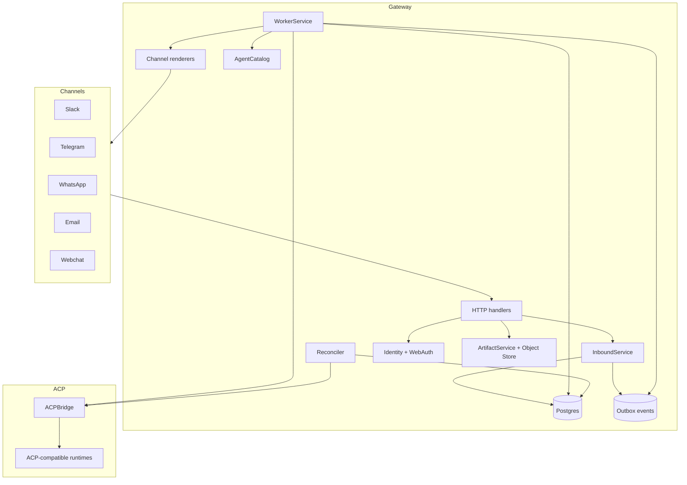
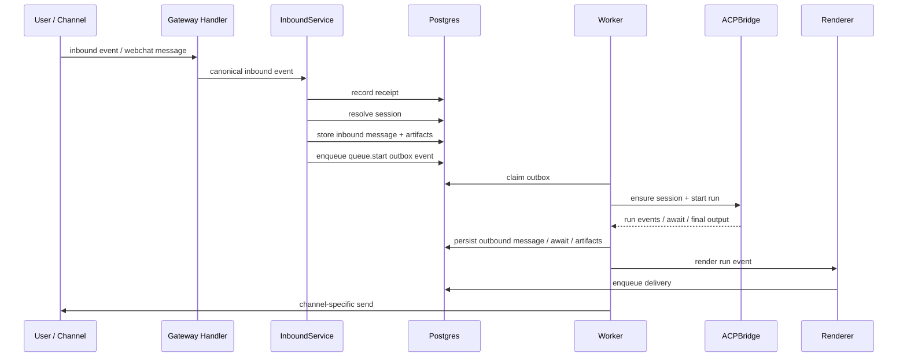

# Architecture

Nexus is a channel gateway around a canonical message/session model and an ACP bridge.

The system is built around four ideas:

1. persist inbound events first
2. serialize work per session through a queue
3. keep ACP-specific behavior behind a bridge
4. render the result back into channel-specific UX

## Reading Guide

If you only want the mental model, read:

1. High-Level Architecture
2. Request Lifecycle
3. Core Services
4. Key Design Choices

## High-Level Architecture

## Request Lifecycle

## Main Runtime Components

### `cmd/gateway`

`cmd/gateway/main.go` loads configuration, initializes tracing, builds the application, and starts:

- the public gateway HTTP server
- the admin HTTP server
- the embedded worker loop

### Composition Root

`internal/app/app.go` is the composition root. It wires:

- Postgres repository
- all channel adapters
- all channel renderers
- ACP bridge
- artifact/object storage
- identity and web auth repositories
- worker and reconciler support
- webchat session hub for SSE updates

This is the best place to inspect first when you want to know what actually runs in-process and how the system is assembled.

### Canonical Domain Model

`internal/domain` defines the stable internal objects:

- `CanonicalInboundEvent`
- `Session`
- `Message`
- `Artifact`
- `Run`
- `Await`
- `OutboundDelivery`

Everything enters the system as a canonical event before channel-specific behavior diverges again on output.

That boundary is important. Channels and ACP backends are allowed to differ, but the core runtime stays centered on one set of internal types.

## Core Services

### Inbound service

`internal/services/inbound.go`

Responsibilities:

- idempotent receipt insertion
- session resolution
- identity link checks
- special command handling
- route selection
- inbound message and artifact persistence
- queue enqueueing

Important behavior:

- DB-first: the gateway records the event before downstream work starts
- per-session serialization: if a session already has active work, new input is queued instead of starting another run
- identity requirements are enforced before work is accepted

You can think of the inbound service as the point where provider-specific payloads stop being provider-specific and become durable Nexus work.

### Worker service

`internal/services/worker.go`

Responsibilities:

- claim outbox work
- start ACP runs
- resume awaits
- persist incremental and final run events
- enqueue channel deliveries
- advance the session queue

Important behavior:

- the worker is channel-agnostic until rendering
- partial ACP output is persisted, then selectively exposed depending on channel
- webchat receives immediate session update notifications through the in-process hub

The worker is where most of the runtime semantics live: start, stream, await, resume, render, deliver, and advance the queue.

### Reconciler

`internal/services/reconciler.go`

Responsibilities:

- requeue stale claimed outbox rows
- recover or requeue stuck queue items
- refresh stale runs from the ACP backend
- expire old awaits
- retry stale deliveries

This is the recovery path that keeps the system eventually consistent after crashes, timeouts, or ACP/backend failures.

If the worker is the fast path, the reconciler is the repair path.

## Persistence Model

Nexus uses Postgres for:

- inbound receipts
- sessions and surface session state
- messages
- artifacts
- session queue items
- runs
- awaits and await responses
- outbound deliveries
- outbox events
- audit events
- webchat auth and identity state

Artifacts themselves are stored through the object store abstraction; metadata stays in Postgres.

The practical consequence is that Nexus can rebuild user-visible state from durable rows instead of relying on in-memory run state.

## Channel Model

Each channel adapter implements the same high-level contract:

- verify inbound webhook or request
- parse channel payload into a canonical inbound event
- optionally hydrate inbound artifacts
- send outbound messages
- send await prompts

Each channel also has a renderer that decides how a `RunEvent` becomes one or more channel deliveries.

That separation matters:

- adapters understand provider payloads and provider APIs
- renderers understand user experience downgrade rules

This is why adding a new channel usually requires two pieces of work, not one.

## ACP Integration Model

The ACP bridge hides runtime-specific details behind one interface:

- `DiscoverAgents`
- `EnsureSession`
- `StartRun`
- `ResumeRun`
- `GetRun`
- replay / lookup helpers

Bridge implementations currently include:

- OpenCode HTTP bridge
- strict/native ACP HTTP bridge
- stdio ACP subprocess bridge
- Parmesan bridge

The agent catalog validates each discovered manifest before the worker accepts an agent for execution.

Nexus is intentionally opinionated here: it does not treat every ACP-speaking backend as equally trustworthy just because it answered discovery.

## Webchat Architecture

Webchat is both:

- a first-party channel adapter
- a browser UI backed by HTTP + SSE

The webchat stack includes:

- auth and session cookies
- CSRF protection
- webchat session resolution
- SSE updates from `/webchat/events`
- artifact proxy/download endpoint
- optional dev-only login endpoint for local testing
- configurable interaction visibility modes

Webchat is also the most complete reference surface in the repo. If you want to understand the full user-facing flow, it is the best place to look.

## Key Design Choices

### DB-first ingest

Inbound events are persisted before work execution starts. This makes duplicate suppression, auditability, and crash recovery much simpler.

### Outbox-driven async processing

Runs and outbound sends are driven by outbox events instead of inline side effects. This gives the worker and reconciler a durable control plane.

### External outbound push

The admin API can enqueue outbound-only reminders, broadcasts, and notifications from an external scheduler or agent runtime. Push requests resolve a target session by session ID, notification surface, channel account, or linked identity, then reuse the same renderer, delivery table, and worker path as ACP run output.

Duraclaw delegation responses use the same path. Nexus preserves `agent_delegation_reference` artifacts, including their `type` and `data` metadata, creates a separate visible session for the delegated ACP session, and attaches switch aliases derived from the target agent handle. Those aliases are scoped to the parent channel surface key, including composite surfaces such as Slack channel-thread keys. The parent session remains active unless the user explicitly switches or selects the delegated session.

### Session queueing

A session can only have one active run at a time. New messages are queued behind the active run or pending await.

### Render last

Nexus persists canonical run output first, then renders it per channel. This keeps channel behavior from contaminating the ACP-facing core.

## Practical Summary

Nexus is easiest to reason about as a four-stage pipeline:

1. channel input becomes a canonical inbound event
2. the event is persisted and queued
3. the worker runs or resumes ACP execution and persists results
4. renderers turn canonical results into channel-specific delivery behavior

## Source Map

Useful entry points when reading the code:

- `cmd/gateway/main.go`
- `internal/app/app.go`
- `internal/services/inbound.go`
- `internal/services/worker.go`
- `internal/services/reconciler.go`
- `internal/ports/ports.go`

## Related Docs

- [Features](./FEATURES.md)
- [Configuration](./CONFIGURATION.md)
- [Supported ACP Protocols and Bridges](./ACP_PROTOCOL.md)
- [Channel Behavior and Compatibility Matrix](./CHANNEL_MATRIX.md)
