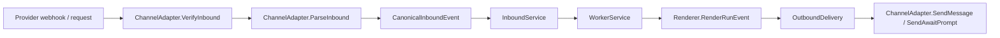

# Extending Nexus With a New Channel

This guide explains how to add a new inbound/outbound channel to Nexus.

The shortest description is:

1. add a channel adapter
2. add a renderer
3. wire both into `app.New`
4. expose the webhook or HTTP entrypoint
5. add tests for parsing, awaits, artifacts, and delivery rendering

## What Done Looks Like

A finished channel integration should:

- accept and verify inbound traffic
- emit correct canonical events
- participate in the normal queue and worker lifecycle
- render awaits and final output in a channel-appropriate way
- appear in the compatibility matrix and tests

## Extension Points

Nexus separates channel work across two interfaces:

- `ports.ChannelAdapter`
- `ports.Renderer`

That split is intentional.

The adapter owns provider protocol details:

- webhook verification
- payload parsing
- outbound provider API calls
- optional inbound artifact hydration

The renderer owns user-facing downgrade rules:

- how a run status becomes channel text
- how awaits are shown
- whether artifacts are separate sends or text fallbacks

If you blur those responsibilities, the code becomes harder to recover, harder to test, and harder to reason about when channel behavior drifts.

## Flow



## Step 1: Implement the Adapter

Create a new package under `internal/adapters/<channel>`.

Implement:

```go
type ChannelAdapter interface {
    Channel() string
    VerifyInbound(ctx context.Context, r *http.Request, body []byte) error
    ParseInbound(ctx context.Context, r *http.Request, body []byte, tenantID string) (domain.CanonicalInboundEvent, error)
    SendMessage(ctx context.Context, delivery domain.OutboundDelivery) (domain.DeliveryResult, error)
    SendAwaitPrompt(ctx context.Context, delivery domain.OutboundDelivery) (domain.DeliveryResult, error)
}
```

### Adapter guidance

- `Channel()` should return the stable channel key used across the system
- `VerifyInbound()` should validate provider signatures or tokens when the provider supports them
- `ParseInbound()` must convert the provider payload into a complete `domain.CanonicalInboundEvent`
- outbound methods should accept already-rendered payloads and only handle provider transport concerns

## Step 2: Emit a Good Canonical Event

Your adapter should populate:

- `TenantID`
- `Channel`
- `Interaction`
- `ProviderEventID`
- `Sender`
- `Conversation`
- `Message`
- `Metadata.RawPayload`

### Session resolution depends on conversation fields

These are the most important fields to get right:

- `Conversation.ChannelConversationID`
- `Conversation.ChannelThreadID`
- `Conversation.ChannelSurfaceKey`

`ChannelSurfaceKey` is what Nexus uses to keep one logical surface stable for queueing and session mapping.

Treat this field as part of the channel contract. If it is unstable, the queueing model becomes unstable too.

Examples from existing channels:

- Slack: `channel_id:thread_ts`
- Telegram: `chat_id`
- WhatsApp: sender phone number
- Email: `sender_email|thread_id`
- Webchat: session/auth surface key

### Responder binding

If the provider has a strong user identity, populate:

- `Sender.ChannelUserID`
- `Sender.IsAuthenticated=true`
- `Sender.IdentityAssurance`
- `Sender.AllowedResponderIDs`

This is what lets awaits be resumed by the right actor.

## Step 3: Add Artifact Support If the Channel Needs It

If inbound messages can contain files, implement:

- `ports.InboundArtifactHydrator`

This lets the gateway:

1. parse artifact references during `ParseInbound()`
2. store raw provider payload in `Metadata.RawPayload`
3. hydrate the actual content into object storage before queueing work

Patterns already in the repo:

- WhatsApp downloads media from the provider API
- Email decodes base64 attachments from the webhook payload

## Step 4: Implement the Renderer

Add a renderer under `internal/services/renderer.go` or split it if the file grows.

You need a `RenderRunEvent` implementation for the new channel:

```go
func (r MyChannelRenderer) RenderRunEvent(ctx context.Context, session domain.Session, evt domain.RunEvent) ([]domain.OutboundDelivery, error)
```

Renderer responsibilities:

- ignore partial events if the channel should not expose them
- render awaits into the best provider-native UX available
- render terminal and failure output
- emit extra deliveries for artifacts when needed

Use the existing renderers as reference points:

- Slack and Telegram use replace/update semantics for status messages
- WhatsApp uses plain sends and interactive buttons
- Email uses message sends and attachment sends
- Webchat mostly persists state and lets the UI read it back

The renderer is where you decide how much fidelity the channel deserves. It should not own provider authentication, webhook parsing, or trust-policy branching.

## Step 5: Wire the Channel Into `app.New`

Update `internal/app/app.go`:

1. instantiate the adapter
2. add it to `channels`
3. add its renderer to `renderers`
4. expose its HTTP route if it has a webhook

Typical wiring points:

- `channels := map[string]ports.ChannelAdapter{...}`
- `renderers := map[string]ports.Renderer{...}`
- `GatewayHandler()` route registration

## Step 6: Add Inbound HTTP Handling

If the channel uses webhooks, add a handler in `internal/app/http.go` or a channel-specific app handler file.

The usual pattern is:

1. read request body
2. call adapter verification
3. parse one or more inbound events
4. optionally hydrate inbound artifacts
5. pass each event to `InboundService.Handle`

If the provider sends batches, implement `ports.BatchInboundParser`.

## Step 7: Add Tests

Minimum recommended coverage:

- inbound verification
- inbound payload parsing
- await-response parsing
- artifact hydration
- renderer output for:
  - normal completion
  - awaiting
  - failure
  - artifacts
- provider send behavior for:
  - text
  - await prompt
  - artifact upload if supported

Also add at least one integration-style handler test if the channel is webhook-driven.

## Recommended Implementation Checklist

- adapter package created
- `ChannelAdapter` methods implemented
- optional batch parser implemented
- optional artifact hydrator implemented
- renderer added
- adapter registered in `app.New`
- renderer registered in `app.New`
- webhook route exposed
- tests added
- channel documented in [CHANNEL_MATRIX.md](./CHANNEL_MATRIX.md)

## Design Constraints to Keep

When adding a channel, do not:

- bypass the canonical event model
- send directly to ACP from the HTTP handler
- embed provider API logic in the renderer
- hardcode trust policy decisions inside the adapter
- bypass the queue for “simple” channels

Those shortcuts make recovery and channel behavior drift harder later.

## Suggested File Layout

```text
internal/adapters/mychannel/
  adapter.go
  adapter_test.go

internal/app/
  http.go              # or a channel-specific handler file

internal/services/
  renderer.go          # or a split renderer file
```

## Existing Channels to Use as References

- Slack: rich interactive channel with artifact upload support
- Telegram: strong interactive support plus explicit session commands
- WhatsApp: constrained interaction model with button fallback rules
- Email: asynchronous transport with attachment hydration
- Webchat: first-party channel with SSE state and browser UI

As a rule:

- start from Webchat or Slack if you want the clearest modern reference
- start from WhatsApp if you need to study downgrade behavior
- start from Email if your channel is asynchronous and attachment-heavy
